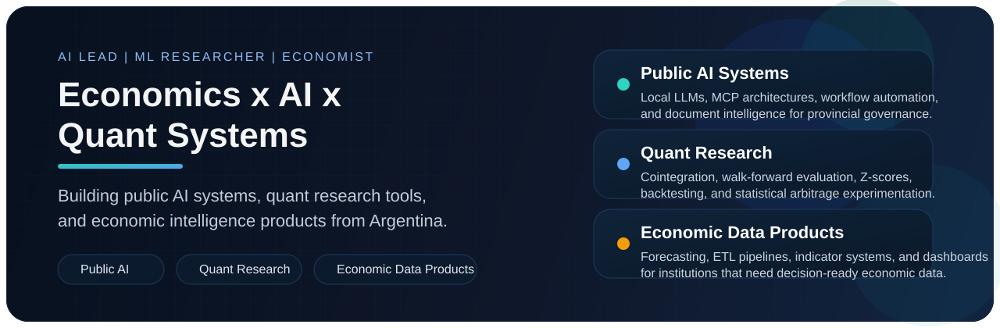

<p align="center">
  
</p>

<p align="center">
  
  
  
</p>

## Building economics, AI, and quantitative systems for real decisions

I'm Ivan Rodriguez, a Data Scientist and Economic Analyst from Argentina working at the intersection of public-sector AI, quantitative research, and economic intelligence systems.

Right now I split my time across four roles:

- **AI Lead, Provincial Government AI Lab**: designing local-LLM and agentic workflows for document automation, intelligent parsing, and public-administration modernization
- **Machine Learning Researcher, Dobby Quantitative Investment**: researching statistical arbitrage, cointegration, backtesting, and risk-aware portfolio experimentation
- **Data Scientist, Provincial Institute of Statistics and Data Science**: building projections, indicators, forecasting workflows, and automated reporting pipelines
- **Researcher, UNNE**: working on multivariate statistical methods applied to academic outcomes

## Start Here

If you want to understand my GitHub quickly, these are the strongest entry points:

- **Quant infrastructure**: [`qbacktest`](https://github.com/Dobby-Quantitative-Investments/qbacktest), [`qstrategy`](https://github.com/Dobby-Quantitative-Investments/qstrategy), [`pair_trading`](https://github.com/ivanfederodriguez/pair_trading)
- **AI products**: [`NIKA-CHATBOT`](https://github.com/Laboratorio-IA-Ctes/NIKA-CHATBOT), [`TekohaSolutions`](https://github.com/ivanfederodriguez/TekohaSolutions)
- **Public-sector and economic data**: [`SerieAgricola`](https://github.com/ivanfederodriguez/SerieAgricola), [`BaseEmergencias`](https://github.com/ivanfederodriguez/BaseEmergencias), [`CBA-CTES`](https://github.com/ivanfederodriguez/CBA-CTES), [`PBG-Corrientes`](https://github.com/ivanfederodriguez/PBG-Corrientes), [`PBG-Chaco`](https://github.com/ivanfederodriguez/PBG-Chaco)

## What I Build

Most of my work lives in three lanes:

- public AI systems grounded in real documents, indicators, and operational workflows
- quantitative research tooling for pair trading, simulation, and portfolio construction
- economic dashboards, ETL pipelines, and measurement systems for institutions that need reliable numbers

## Applied Systems

Beyond repositories, these are the kinds of systems I design and ship:

- **Automated Economic Monitoring Dashboard**: daily ETL pipelines for CBA, IPC, EMAE, and regional indicators using Python and GitHub Actions over heterogeneous JSON and Excel sources
- **AI implementation frameworks for provincial governance**: technical architectures using Whisper, Gemini, Llama, LangChain, LangGraph, and MCP for workflow automation and document parsing
- **Laboratorio Z-Score**: a Streamlit-based analytical platform for statistical modeling, real-time Z-scores, and historical pair-trading backtests

## Selected Work

<table>
  <tr>
    <td width="50%" valign="top">
      <h3><a href="https://github.com/Dobby-Quantitative-Investments/qbacktest">qbacktest</a></h3>
      <p>Backtesting framework for systematic strategies with Monte Carlo simulation, parameter optimization, stress testing, event systems, and multi-currency portfolio support.</p>
    </td>
    <td width="50%" valign="top">
      <h3><a href="https://github.com/Dobby-Quantitative-Investments/qstrategy">qstrategy</a></h3>
      <p>Composable strategy framework built around reusable contracts for universe selection, features, signals, portfolio construction, and risk overlays.</p>
    </td>
  </tr>
  <tr>
    <td width="50%" valign="top">
      <h3><a href="https://github.com/ivanfederodriguez/pair_trading">pair_trading</a></h3>
      <p>Statistical-arbitrage research toolkit with ADF and Johansen diagnostics, rolling hedge ratios, Z-score signals, backtesting, and portfolio-weighting experiments.</p>
    </td>
    <td width="50%" valign="top">
      <h3><a href="https://github.com/Laboratorio-IA-Ctes/NIKA-CHATBOT">NIKA-CHATBOT</a></h3>
      <p>Voice-enabled economic assistant for Argentine indicators, orchestrated with n8n, Groq, MCP, speech-to-text, and text-to-speech.</p>
    </td>
  </tr>
  <tr>
    <td width="50%" valign="top">
      <h3><a href="https://github.com/ivanfederodriguez/monitor-precios">Monitor de Precios</a></h3>
      <p>Streamlit dashboard for weekly retail-price dynamics, combining a parameterized MySQL query, pandas transformations, interactive filters, and Plotly time series.</p>
    </td>
    <td width="50%" valign="top">
      <h3>Economic and public-data systems</h3>
      <p>Projects for agricultural series, emergency databases, household-basket tracking, and regional economic measurement built for real public-sector and institutional use.</p>
    </td>
  </tr>
</table>

## Background

- Diploma in Data Science, Universidad Nacional del Nordeste (UNNE)
- Economics degree, Universidad Catolica de Salta (thesis in progress)
- Academic research program at UNNE focused on multivariate statistical modeling

## Working Stack

```text
Python, R, SQL, pandas, numpy, Streamlit, Jupyter
LangChain, LangGraph, MCP, n8n, RAG, ChromaDB, FAISS
FastAPI, Flask, Docker, AWS, GitHub Actions
forecasting, econometrics, clustering, ETL, dashboards, backtesting
```

## Current Focus

- building local and open-source AI systems for public-governance workflows
- making quantitative research infrastructure more reusable and production-friendly
- turning economic complexity into clean, operational data products

## Connect

- LinkedIn: [in/ivanfederodriguez](https://www.linkedin.com/in/ivanfederodriguez)
- GitHub: [@ivanfederodriguez](https://github.com/ivanfederodriguez)

<p align="center">
  <sub>Economics with code. AI with grounding. Systems that ship.</sub>
</p>
